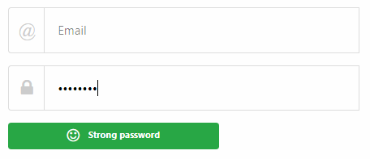

Simple javascript password strength meter with animation
========================================================

* JS implementation based on answers:
* https://stackoverflow.com/questions/948172/password-strength-meter




NOTES
-----

* Entrophy score is calculated for each unique letter (+5 points) but only +1 point for repeated chars
* Extra score bonus is awarded for combining with digits, lower & upper letters and non-word characters
* The "id_entrophy" element can be set optionally, if score needs to be submitted to server
* For animation set ID of DIV e.g. "id_strip" and adjust CSS - see bellow
* No jQuery dependency and no support for very old browsers (required native JS function "document.getElementById")


Example implementation - javascript:
-----------------------------------

```js
window.simple_password_checker.init({
	id_password : "formsignup-password",
	id_entrophy : "formsignup-password_strength",
	id_strip : "meter-inner",
	text_weak : "<i class='fa fa-frown-o'></i> Weak password",
	text_good : "<i class='fa fa-meh-o'></i> Good password",
	text_strong : "<i class='fa fa-smile-o'></i> Strong password",
	css_weak : "badge badge-danger",
	css_good : "badge badge-warning",
	css_strong : "badge badge-success",
	score_good : 50,
	min_length : 8
});
```

Adjust CSS - e.g.
-----------------

```css
#meter-inner{
	display: block;
	min-height: 25px;
	transition: 0.5s; /* ensure width animation */
}
```

License
-------

Distributed without licence, use at your own risk & will :-)
